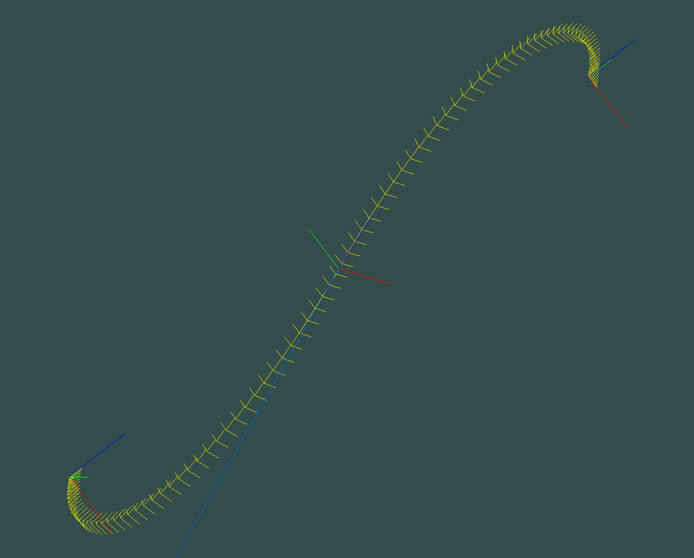
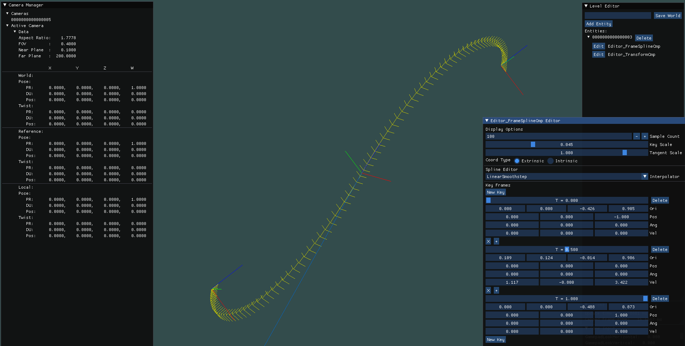
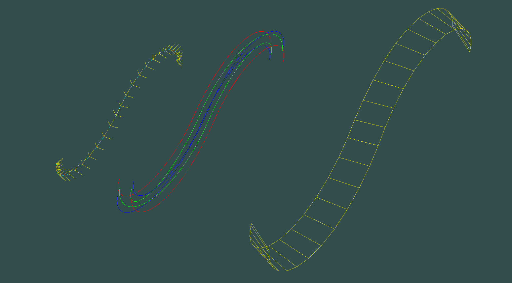
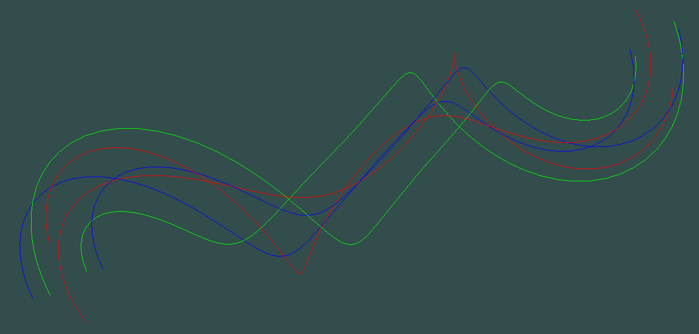
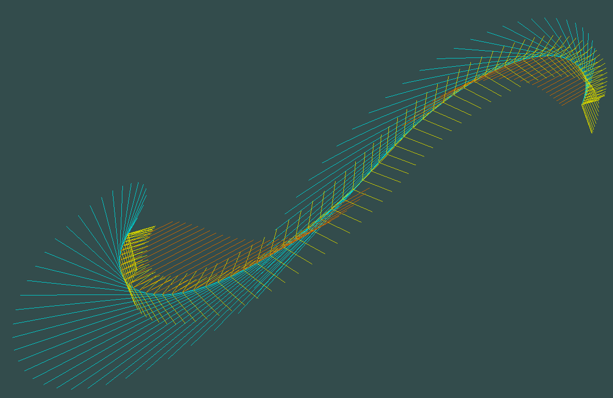
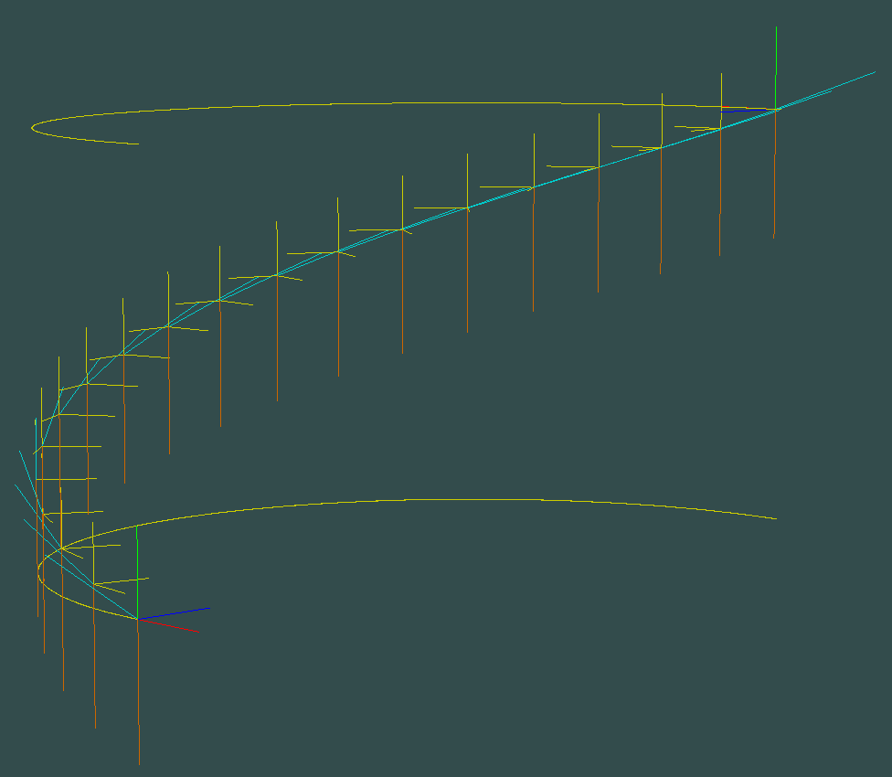
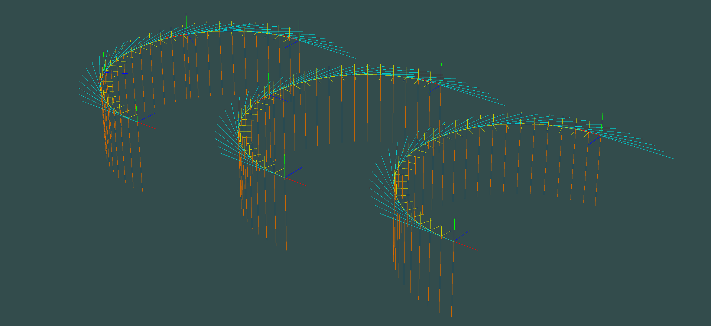

# Moving Frames

> <u>Note</u>: this repository is a *fork* of an earlier repository I made on a server I share with some friends. Even so, I am the sole contributor of that repository

## Overview

The repo is a proof of concept of simple splines of poses (positions and orientations together) implemented using dual quaternions. The core idea is to take the geodesics of the space of unit dual quaternions and use them like they were the straight lines of euclidean space. It turns out that those geodesics are easier to compute than it sounds!

It also turns out that spending some time creating a micro engine (instead of just focusing on the main feature) goes a long way towards making debugging easier, making data creation more straightforward and overall making progress faster. That's how the repo ended up with some (very) barebones features like (object-oriented) entities made up of components, world/entity handling, a level editor interface, camera and serialization. I'll surely be using them again in future projects.

Here is an example of the interface I used to setup the following pictures. The tripods represent the editable key frames that are then interpolated by the spline algorithms. Each key frame is described by two dual quaternions: one for the pose (orientation + position) and one for the twist (linear and angular velocities).

The code relies on GLFW for window handling, GLAD (OpenGL 4.5) for graphics, GLM for maths, Assimp for model loading and Dear ImGui for the graphical interface.

The splines can take on many different guises, making use of geometry shaders:

In the picture above, orange vectors represent angular velocities and light blue vectors represent 'linear' velocities.

## Splines, courtesy of Dual Quaternions

### Geodesics

'Reference frames', 'poses', 'transforms', 'rigid motions' are names we use to describe elements of the group $SE(3)$ or any isomorphic group (we usually care about how these things act on vectors, rarely about how they are represented). Unit dual quaternions are a convienient way of representing them in practice[^1]

Rigid motions can notoriously be decomposed as a rotation about an axis in euclidean space followed by a translation along the same axis (see [Chasles' Theorem (Wikipedia)](https://en.wikipedia.org/wiki/Chasles%27_theorem_(kinematics))). This decomposition is quite convenient when talking about geodesics in $SE(3)$: it turns out that we can see a geodesic path from the identity to any rigid motion as a helicoidal path that gradually and continuously rotates and translates along that same axis. This is shown in the following picture:

In a Lie group, such as this one, geodesics are easier to express than they usually are in generic spaces[^2]: a geodesic between group elements can be parameterized by making use of the exponential and logarithm[^3] maps:

$$
\left( A,B,t \right) \longmapsto \exp\left( t \cdot \log \left( BA^{-1} \right) \right) A
$$

$\boxed{\text{Detail}}:\text{What does the formula \textit{mean}?}$

  Given elements $A$ and $B$ in the group, let's construct a curve from $A$ to $B$, parameterized by $t \in \left[0,1\right]$.
  First, take the group element that transforms $A$ into $B$. That is:  
  $\textcolor{orange}{BA^{-1}}$  
  Then find the tangent vector which, when followed for $1$ second, brings us from the identity to the element $BA^{-1}$:  
  $\textcolor{orange}{\log \left( \textcolor{white}{BA^{-1}} \right)}$  
  Based on the value of $t$, take just the first portion of this tangent vector:  
  $\textcolor{orange}{t \cdot} \log \left( BA^{-1} \right)$  
  Now follow this vector along the group for $1$ second (or, equivalently, follow the vector $\log \left( BA^{-1} \right)$ for $t$ seconds:  
  $\textcolor{orange}{\exp \left( \textcolor{white}{t \cdot \log \left( BA^{-1} \right)} \right)}$  
  This is now a geodesic curve connecting the identity to $BA^{-1}$. Let's move it from the identity to $A$, so that it connects $A$ to $B$:  
    $\exp \left( t \cdot \log \left( BA^{-1} \right) \right) \textcolor{orange}{A}$  
  And there it is!
___

In particular, in the case of $SE(3)$, I have seen the interpolating geodesic curve being called 'Sclerp' in literature (as in 'SCrew Linear intERPolation'), after the screw motion it attains.

The exponential map usually needs to be computed via a costly power series. Luckily, in the case of dual quaternions and rigid motions it can be calculated in closed form. The code of this repo implements one of the equivalent expressions that can be found in literature[^4].

### From geodesics to splines

There are currently two implemented spline interpolation strategies. They both grant $\mathcal{C}^1$ regularity at the keyframes.

  * '__Linear Smoothstep__': the source and target key frames are made to move with constant twist via the exponential map. The moving frames are then interpolated using a Sclerp, where $t$ is reparameterized via a smoothstep function. The $\mathcal{C}^1$-ness is granted by the derivative of the reparameterization being nullified at the extremes.
  * '__Cubic Bézier__': the [De Casteljau algorithm (Wikipedia)](https://en.wikipedia.org/wiki/De_Casteljau%27s_algorithm) is applied to the moving frames, using dual quaternion geodesics in place of line segments. This ends up being a sort of cubic Bézier curve variant.

The first strategy is definitely a cheaper way of obtaining $\mathcal{C}^1$ continuity. Despite this, the Bézier-like curve has two important properties: it can be used to obtain geodesics (helixes, circular arcs[^5], lines) parameterized with constant speed, and it also can be *subdivided*. This means that inserting a key frame in a spline arc, with the exact same twist as it already had, doesn't affect the interpolated curve. It's a great thing to have when editing curves.

Here is an example of a cubic Bézier displaying both properties (if you squint hard enough you'll notice that some curves have more tripods than others):

## Wrapping up

It's pretty satisfying to now have a tool with which I can manipulate objects from such an otherwise abstract topic: a six-dimensional Lie group. It's also very empowering to have something I can show people and demonstrate what lies behind all that symbol manipulation. Hopefully it can even be used as an interactive aid to understanding what Lie groups are all about.

Of course, lots of improvements and additions are desperately waiting to be implemented. Some of these, in no particular order, would be: 
  * More shaders, to show off the beauty hidden in these curves
  * Cameras attached to splines (they would be great for that, since they're made precisely to interpolate positions and orientations in tandem)
  * Make some calculations more numerically stable
  * More key frame interpolation methods
  * User interface improvements

[^1]: Keeping in mind that the group of unit dual quaternions 𝔻&#119982;&#120805; is actually a double cover of the special euclidean group SE(3).
[^2]: Riemannian manifolds.
[^3]: Multiple geodesics between two group elements may exist, in which case the choice of geodesic is determined by the choice of the logarithm branch being used.
[^4]: It's worth noting that a formula very similar to Euler's formula for the complex exponential exists. It's more computationally expensive, but it makes up for it in mathematically expressiveness.
[^5]: Yes, you can obtain circular arcs with this interpolation!
